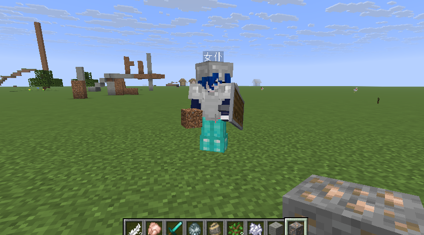

# Multimodal-AI-Companion

> **DeskPet** · 一只住在你桌面上的鲸鱼女仆：会待机巡逻、会聊天、会朗读、会看图，陪你打 Minecraft，
> 还能指挥游戏里的智能女仆干活。

用 Python + PySide6 写成，本体是**插件宿主** —— 一个插件都不装也完整可用。

<div align="center">
  
</div>

`版本 2.31.0` · `MIT` · `Python 3.10+` · `Windows`

> **本仓库不含动画素材**：首次启动是**静态形象**，气泡 / 聊天 / 语音 / 游戏联动 / 设置全部可用，
> 只是不会动。放一份素材或安装素材包即可恢复动画 —— 见下方「插件」。

## 仓库里有什么

| 目录 | 是什么 | 文档 |
|---|---|---|
| `desktop-pet/` | 桌面宠物主体（同时是插件宿主） | [README](desktop-pet/README.md) · [CHANGELOG](desktop-pet/CHANGELOG.md) |
| `deskpet-mod/` | Minecraft Fabric 模组：事件采集 + 建筑识别 | [README](deskpet-mod/README.md) |
| `deskpet-tools/` | 绿幕视频 → 桌宠动作 → 角色包 | [README](deskpet-tools/README.md) |
| `docs/` | 工作区级文档（设计 / 审计 / 方案） | [索引](docs/README.md) |

## 30 秒跑起来

```bash
pip install -r desktop-pet/requirements.txt -i https://pypi.tuna.tsinghua.edu.cn/simple
python desktop-pet/main.py
```

右键宠物 →「设置」→「基础」选一个 AI 后端（内置官方 API / 千问 / 自定义 OpenAI 兼容端点），
填上 Key 就能聊。**不需要任何插件。**

```bash
python desktop-pet/main.py --doctor   # 查看插件与扩展点状态
python desktop-pet/main.py --smoke    # 只启动自检，不开界面
```

## 设置界面

右键宠物 →「设置」是**唯一设置入口**，左栏 13 页按 `宠物 / 对话 / 联动 / 扩展` 四组排列。
所有 AI 行为都在界面里配，不用改配置文件。

<div align="center">
  
</div>

上图为「对话」页：AI 模式（此处为游戏模式）、联网搜索、对话记忆、Wiki 知识提炼与过滤强度、
人设精简程度、辅助调用后端（留空即跟随主对话）。

## 联动效果

和游戏里的智能女仆联动：女仆上线后可在聊天栏对话、按住 `Y` 语音说话，AI 回复以多行气泡冒在女仆头顶；
也可以让桌宠隐退、只当 AI 后端。

<div align="center">
  
</div>

> 配套模组：[`deskpet-mod/`](deskpet-mod/README.md)（事件采集 + 建筑识别）。
> 女仆本体是姊妹项目 SmartMaid（独立仓库）。

## 插件（可选，不装也能跑）

宿主为每个扩展点都提供**内置最小实现**：拔掉所有插件，宠物依然能启动、聊天、进游戏模式。

| 插件 | 扩展点 | 说明 | 状态 |
|---|---|---|---|
| `wiki-local` | wiki-knowledge | 本地 Minecraft Wiki 检索 + 本地精炼小模型选句压缩（纯 numpy，轻量） | 随仓库（数据需自建） |
| `agentic-rag` | wiki-knowledge + **knowledge-qa** | 向量 + BM25 多路召回 → RRF 融合 → 规则重排；既做游戏事件注入，也做**用户提问检索**（重型） | 随仓库（索引需自建，约 345MB） |
| 官方动画素材包 | assets | 完整动作动画，覆盖静态形象 | 单独发布 |
| `deepseek-web` | ai-provider | DeepSeek 网页版后端（逆封装，**唯一支持传图**、服务端记忆） | 随仓库（需装 `wasmtime` 等，见 `requirements-web.txt`） |

- 接口与写法：[docs/PLUGIN_API.md](desktop-pet/docs/PLUGIN_API.md) · 最小示例：[docs/example-plugin/](desktop-pet/docs/example-plugin/)
- 管理：设置 →「扩展 → 插件」（启停、打开插件目录）
- 插件是**可执行代码**，运行在主进程内、宿主不做沙箱，请只安装可信来源。

## 不随仓库发布的内容

| 内容 | 体积 | 原因 | 怎么获得 |
|---|---:|---|---|
| 完整动画素材（1663 帧） | ~248MB | 体积 | 配套 [**动画资源仓库**](https://github.com/oyxdsg/Multimodal-AI-Companion-Assets) 的 Release 附件，解压到 `desktop-pet/assets/` |
| 绿幕素材源 | ~87MB | 离线加工输入 | 用 `deskpet-tools/` 自己转 |
| Minecraft Wiki 数据库 | ~250MB | 派生数据（Wiki 为 CC BY-NC-SA，与 MIT 不兼容） | 用 `wiki-local` 插件自带脚本重建 |
| RAG 向量/BM25 索引 | ~345MB | 体积 + 重依赖（faiss / torch） | 用 `agentic-rag` 插件自带脚本重建 |

## 文档

- 桌宠：[README](desktop-pet/README.md) · [CHANGELOG](desktop-pet/CHANGELOG.md) · [文档索引](desktop-pet/docs/README.md)
- 设计稿：[AI 接口通用化](desktop-pet/docs/design/DESIGN_AI_PROVIDERS.md) · [AI 与检索链路演进](desktop-pet/docs/design/DESIGN_AI_ROADMAP.md) · [插件化](desktop-pet/docs/design/DESIGN_OPTIONAL.md) · [本地意图识别](desktop-pet/docs/design/DESIGN_NLU.md)
- 报告：[测试方案](desktop-pet/docs/reports/TEST_PLAN.md) · [Wiki 审计](desktop-pet/docs/reports/WIKI_AUDIT.md) · [全链路测试](desktop-pet/docs/reports/CHAIN_TEST_REPORT.md)
- 原始设计稿（人设 / 建筑 / 情绪系统）：[docs/source/](docs/source/)
- 开源方案：[docs/开源发布方案.md](docs/开源发布方案.md)

## 许可

主体代码 **MIT**，见 [LICENSE](LICENSE)。
第三方组件与数据声明见 [NOTICE](NOTICE) —— 含 Lucide、Ant Design、Minecraft Wiki、
车万女仆、可选插件与素材的许可说明。

> **关于 `deepseek-web` 插件**：它是对 `chat.deepseek.com` 网页内部接口的**逆向实现**，
> 与 DeepSeek 官方无关。使用它需自行确认并遵守服务方条款，账号与可用性风险自担；
> 追求稳定请优先使用官方 API 或千问。
