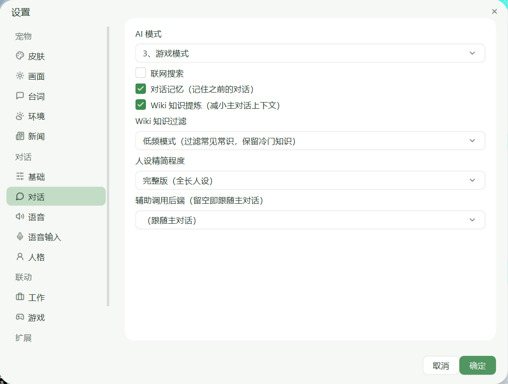

# 桌面宠物 · DeskPet

> 版本 **2.31.0** · 更新历史见 [CHANGELOG.md](CHANGELOG.md) · MIT

一个用 Python + PySide6 做的桌面宠物。宠物会待机、巡逻走动、对点击做出反应，还能和你聊天、
看懂你发的图片、按住快捷键语音对话、播报新闻、陪你打 Minecraft、陪你玩文字修仙游戏，
并把说的话朗读出来。

本体是**插件宿主**：AI 后端、游戏知识、动画素材都是可选插件，**一个都不装也完整可用**。

<div align="center">
  
</div>

> **没有动画素材时会以静态形象启动**：气泡、聊天、语音、游戏联动、设置全部保留，只是不会动。
> 把帧图放进 `assets/<动作>/`，或安装动画素材包，即恢复动画（见 [assets/README.md](assets/README.md)）。

## 快速开始

```bash
pip install -r requirements.txt -i https://pypi.tuna.tsinghua.edu.cn/simple
python main.py
```

右键宠物 →「设置」→「基础」选一个 AI 后端并填 Key 即可聊天。自检与静默启动：

```bash
python main.py --doctor    # 列出插件、扩展点状态、缺失依赖与补装指引
python main.py --smoke     # 只跑启动自检，不开界面
```

环境要求：Python 3.10+、Windows（本地语音与 Edge 登录依赖 Windows）。

## 功能一览

**宠物本体**：透明 PNG 帧序列动画（自动裁剪 / 统一缩放 / 脚部贴底）、随机巡逻、点击反应、
拖拽、动作序列（右键菜单）、亮度 / 对比度 / 饱和度实时调节、桌面强制置顶。

**AI 与语音**：5 家可插拔 AI 后端、多人格、图片输入、流式输出、语音朗读（4 种引擎）、
语音输入（双离线识别引擎）、音画同步、性能日志。

**联动**：Minecraft 模组联动（事件采集 + 建筑识别）、智能女仆模组联动（指令闭环 +
游戏内对话）、文字修仙游戏联动、环境提醒（时间 + 天气）、新闻播报、工作模式。

**工程**：插件宿主与公共契约、统一消息队列、AI 调用软限流、事件双通道去重、
本地意图识别小模型（含拼音模糊匹配）、trace/span 可观测性。

## AI 对话

### 提供方

设置 →「基础」→「AI 后端（提供方）」：

| 提供方 | 说明 |
|---|---|
| **DeepSeek（官方 API）**（默认） | 无状态、需 API Key；模型以官方 `/models` 实测为准：`deepseek-flash` / `deepseek-v4-pro` |
| **千问（官方 API）** | 阿里云百炼，流式输出；与千问 TTS 搭配最佳。含 Omni 系列（能自己出语音） |
| **Anthropic Claude** | 原生 `/v1/messages` 协议 |
| **自定义（OpenAI 兼容）** | 填任意 OpenAI 兼容端点：Ollama / vLLM / LM Studio / 聚合平台 |
| **DeepSeek（网页版）** | 走 chat.deepseek.com 网页内部接口（**非官方**），免费、服务端记忆、**唯一支持传图** —— 需装 `deepseek-web` 插件与 `wasmtime`（见 `requirements-web.txt`），使用需自行遵守服务方条款 |

底层是**供应商注册表 + 协议适配器**（见 [DESIGN_AI_PROVIDERS.md](docs/design/DESIGN_AI_PROVIDERS.md)）：
上下文策略（服务端记忆 / 客户端组装）由**能力位**推导，传输协议（OpenAI 兼容 / Anthropic / 网页版）
可插拔。接新厂商只需加一条注册表记录。

> **模型 id 以厂商端点为准**：第三方榜单 / 缓存里的型号在该端点上可能根本不存在。
> DeepSeek 旧 id（`deepseek-chat` / `deepseek-reasoner`）会被服务端静默别名成 `deepseek-flash`，
> 程序读时归一化后按真实模型名记账。

「基础」页按所选提供方与模型**动态渲染**：

- **模型**：可编辑下拉，预置清单 + 支持手填新模型
- **能力标签**（只读一行）：`[流式] [识图] [联网] [思考:分档/开关/预算] [能力未验证]`
  —— 发图前就能看出这个后端支不支持
- **思考**：按模型真实语义变化（分档 / 纯开关 / token 预算），档位按「提供方 + 模型」分别记忆
- **测试连接**：用界面当前输入发一条最小请求，不必先保存
- **辅助调用后端**：Wiki 提炼 / 记忆提炼 / 播报润色可另指更便宜的提供方

### API Key 与登录

| 提供方 | 怎么配 |
|---|---|
| DeepSeek 官方 API | [platform.deepseek.com](https://platform.deepseek.com) 建 Key，粘进「基础」页 |
| 千问 | [阿里云百炼控制台](https://bailian.console.aliyun.com/) 开通并建 Key（**语音合成也用它**） |
| Anthropic | [console.anthropic.com](https://console.anthropic.com) |
| 自定义 | 端点 + 模型名手填，Key 按需 |
| DeepSeek 网页版 | 右键「登录 DeepSeek」，驱动系统 Edge 自动登录并持久化凭证（需装插件） |

各提供方的 Key 与模型**分别保存**，切换不互相覆盖。

### 聊天窗口

右键「聊天」打开：无边框圆角卡片、气泡消息、可拖动；标题栏只有「新会话 / 关闭」。
所有设置统一走宠物右键「设置」。

- 用户消息海蓝实心气泡；宠物回复从头顶冒出，并可驱动做对应动作
- **图片输入**：输入框左侧「回形针」选图（最多 4 张，可预览移除），自动等比压缩（长边 ≤1568）
  后随消息发出。目前只有 DeepSeek 网页版后端支持传图，其余后端会提示并忽略图片
- **动作联动**：回复里可夹带 `{动作词}`（10 个：待机 / 思考 / 开心 / 害羞 / 兴奋 / 挥手 / 惊讶 / 审阅 / 跳跃 / 睡眠），
  旧版 `[开心]` 等也兼容；标签不会显示在气泡里
- **消息队列**：AI 回复 / 语音输入 / 游戏日志 / 新闻 / 工作 / 环境提醒 / 随机台词按优先级排队串行显示，
  互不打断；点击气泡可立即跳过
- **跨重启记忆**：会话 ID 持久化，重启后续接上次对话（DeepSeek 后端）

### 本地预处理（NLU）：说人话直接干活

聊天与语音输入会先过本地意图识别小模型（纯 numpy、1.35MB、毫秒级），判定你在指挥女仆干活时
**直接执行**，再把「原话 + 是否已执行 + 配方 / 背包明细」交给大 AI 润色：

```
你说：帮我合成一把稿子
  ↓ 本地识别：合成（置信度 0.99）+ 镐子（拼音模糊匹配，你其实想说的是「镐子」）
  ↓ 查配方 + 查女仆背包（游戏内为唯一事实来源）
  ↓ 材料够 → 自动合成；不够 → 不执行
宠物说：木棍一根都没有呢，先去砍点树嘛，人家等你~
```

- **只在高置信时执行**：置信度 ≥0.85 且意图允许自动执行才动手，否则只把猜测作为提示交给大 AI
- **闲聊不误触发**：实测「闲聊被误判成指令」概率 0.00%
- **需要女仆在场**：不开游戏 / 女仆未连接时只提示不执行；坐标类缺坐标也不自动执行
- 覆盖女仆全部指令（合成 / 烧炼 / 挖矿 / 耕作 / 建造 / 攻击 / 护卫 / 收集 / 装备 / 转移 / 存取箱子 / 移动 / 坐下…）
- 意图边界口径见 [DESIGN_NLU.md §11.1](docs/design/DESIGN_NLU.md)；重训 `python -m nlu.train`，验证 `python tests/test_nlu.py`

## 语音

### 语音朗读（TTS）

| 模式 | 说明 |
|---|---|
| 关闭 | 不朗读 |
| Edge 语音 | 微软 Edge TTS，联网，音质好；**自动读系统代理**，国内约 2 秒 |
| 本地语音 | Windows SAPI 离线，即时出声 |
| **千问 TTS** | 百炼 qwen TTS，句子级逐句合成播放；模型与音色来自**实时目录**（9 个非实时模型 × 48 音色） |
| **模型原生语音** | Omni 模型自己出音频，不走外部 TTS；边生成边播，音色可选 |

- **全排队不打断**：所有语音经全局单队列串行播放；**音画同频**（声音开始 = 气泡开始，结束 = 气泡结束）
- **失败自动回退**：Edge / 千问合成失败自动用本地 SAPI 朗读，内容不丢
- **口头禅语音缓存**：预设台词每句只在第一次说出时合成一次缓存为本地 wav，之后零 API
- **语速 / 音量**：各引擎统一生效（语速默认 110%，范围 50–200%）

**千问音色按模型过滤**（实测 `qwen3-tts-flash` 48 个、`qwen3-tts-instruct-flash` 24 个、
`qwen-tts` 只有 4 个）。目录启动时从官方文档抓取并缓存，离线三级回退（缓存 → 随包快照 → 兜底默认）。
被限流时会自动重试一次，避免突然掉到本地机器人音。

**模型原生语音**（如 `qwen3-omni-flash`）只能走流式：原生音频仅在 `stream=true` 时返回
（base64 裸 PCM16 / 24kHz 单声道）。走原生语音时不调用外部 TTS，避免双声；
音频与文字同源生成，**念错了没法只改语音**，所以另发一段前置硬约束（口语短句、禁 `{动作}` / `【指令】`）。
不同 Omni 模型可用音色不同，音色选择按对话模型分别记忆。

### 语音输入（STT）

按住全局快捷键（默认 **Y**）说话，松开即识别并自动发给 AI；回复气泡 + 语音，识别文本同步进聊天窗口。

- **双离线引擎**：Vosk（~42MB，默认）/ faster-whisper（更准，tiny ~75MB）；缺模型自动下载，
  失败自动回退另一引擎
- 识别结果经 OpenCC 统一转简体
- 静音超时（默认 2.5s）自动收尾；开始录音自动停 TTS 保证收音干净
- 模型目录为**纯英文路径** `%USERPROFILE%\.deskpet-stt`（识别引擎无法加载含中文的路径）

## 设置

右键「设置」是**全局唯一设置入口**。左栏按组排列，共 **13 页**：

```
宠物：皮肤 / 画面 / 台词 / 环境 / 新闻
对话：基础 / 对话 / 语音 / 语音输入 / 人格
联动：工作 / 游戏
扩展：插件
```

<div align="center">
  
</div>

对话相关主要项：

| 设置项 | 说明 |
|---|---|
| AI 后端（提供方） | 见上文「提供方」 |
| 端点 / API Key | 各提供方分别保存；自定义提供方端点必填 |
| 模型 / 能力标签 / 思考 | 按当前模型动态渲染 |
| 测试连接 | 验证 Key / 端点 / 模型名 |
| 辅助调用后端 | Wiki 提炼 / 记忆提炼 / 播报润色用哪个提供方 |
| AI 模式 | 日常 / 工作 / 游戏 |
| 对话记忆 | 跨重启续接上次会话 |
| 人设精简程度 | 完整版 / 精简版 / 极简版（按后端过滤可选；极简版功能规则完整保留） |
| 人格 | 宠物女仆 / 御坂美琴 |
| 宠物名称 | 保存后替换当前人格 prompt 里的角色名 |
| 语音朗读 / 音量 / 语速 | 见「语音」一节 |
| 插件 | 启停插件、打开插件目录（改动重启生效） |

点「确定」统一保存（写 QSettings；聊天窗开着则同步运行时状态）。
「画面」页滑块**拖动即时预览**，停手 150ms 后才重建画面缓存。

## 游戏联动（Minecraft）

> **联动互斥**：设置 →「游戏」→「联动游戏」在「关闭 / 我的世界 / 修仙小游戏」中单选，
> Minecraft 与修仙同一时间只激活一个。右键「启动修仙游戏」会自动切到修仙。

数据源两种（默认自动）：

1. **Fabric 模组联动（推荐）**：`deskpet-mod` 精确监听玩家行为，
   每 20 秒聚合成分级窗口写入 `.minecraft/deskpet/`。监听破坏 / 击杀 / 获得 / 受伤 / 移动 /
   死亡 / 进度 / 跨维度 / 聊天 / 进出世界（配方类进度自动过滤）
2. **日志回退**：未装模组时读 `latest.log` 增量识别事件（有模组时**不回退日志**，避免混淆）

互动规则：

- 所有事件**统一 20 秒汇报一次**给 AI（可在设置中调 20/60/180/600 秒）；AI 调用 15 秒冷却防限流
- 事件从知识源检索相关知识后交给 AI，以游戏伙伴身份回应（气泡 + 语音）；同一实体 10 分钟内只注入一次
- **自动识别你的游戏角色名**并告知 AI；称呼随人格（女仆叫「主人」，御坂叫「伙伴」）
- 游戏模式下宠物**不再自动巡逻**（仍可手动拖动）；周期强制 TOPMOST 置顶
- 若游戏是**独占全屏**（MC 默认 F11），Windows 机制下任何窗口都无法覆盖 ——
  请改成「窗口化全屏 / 无边框」

### 建筑识别（模组侧，桌宠端已对接）

`deskpet-mod` 内置建筑识别：记忆玩家放置的方块 → 三维结构分析 → 本地规则引擎分类
（高塔 / 尖塔 / 灯塔 / 城墙 / 桥 / 泳池 / 喷泉 / 农场 / 牧场 / 庄园 / 雕像 / 家园 / 城堡 / 别墅 / 房屋等）
+ 意图预测 + 三维评分 → 输出感知包到 `deskpet/buildings/latest.json`。

桌宠端每 20s 读取（按窗口序号去重）：

- **进行中**（`state=in_progress`）：用 `intent.hint` 口语提示播报（如"在盖木质房屋，地基刚铺好~"），
  **不占 AI**；按「意图 + 阶段」去重，阶段推进才再播报
- **已完成**（`state=complete`）：调 AI 润色描述；AI 提示附程序给出的**隐式评价 + 针对性建议**，
  由 AI 按人格组织语言说出；未登录 AI 时回退模板描述
- 评分（结构 / 装饰 / 配色 + 等级）仅供程序生成建议用，**不向玩家报分**

### 智能女仆联动（SmartMaid 模组）

> 入口：设置 →「游戏」→「联动游戏 = 我的世界」。

- **游戏内对话**：聊天栏 `/maidchat` 进入对话模式，说的话经 WS 到桌宠 → AI 回复经 `chat_reply`
  回女仆（多行气泡 + 游戏内回显 + 桌宠朗读）
- **Y 键语音**：按住 Y 说话，女仆在线时识别结果自动作为对女仆说的话
- **指令闭环**：AI 回复夹带 `【指令】` 或原生 tool_calls 经 `MaidLoop` 解析下发；`world:~` 自动纠错为主人坐标
- **桌宠隐退**：勾选「召唤女仆后隐藏桌宠窗口」后，女仆上线即隐藏窗口与气泡（AI / STT / TTS 后端保留），
  女仆离线自动恢复
- 协议：模组 → 桌宠 `chat` / `maid_presence`；桌宠 → 模组 `chat_reply`；事件 / 感知 / 指令沿用既有通道

### 修仙小游戏（凡人修仙）

在「设置 → 游戏」页点「启动修仙游戏」（自动把「联动游戏」切到修仙）：

- 桌宠管理一份游戏副本于 `games/xiuxian`（独立运行，不污染原项目）
- 一键拉起游戏服务器（node，3000 端口）并用系统 Edge 打开
- **零游戏侧改动**：通过 playwright 直接读浏览器 `localStorage` 与页面日志，不需要给游戏埋点
- 开局 / 历事 / 突破 / 死亡 / 结局时以「修仙道侣」身份互动；关键事件立即、普通历事按 30 秒汇总

## 知识注入（`wiki-knowledge` 插件）

**默认不注入**：大模型自身掌握绝大多数 Minecraft 知识，所以「不注入」是一等模式（更省 token、
零延迟、零本地库），不是残缺模式。

装上 `wiki-local` 插件后恢复本地知识链路：

```
curated 人工知识 → 本地精炼小模型选句压缩（纯 numpy、离线毫秒级、零 API）→ Wiki 原文兜底
```

- **实体提取**：标题 + 重定向别名反向提取（覆盖全站）；单字实体需事件上下文才采信
  （「[击杀] 猪 x1」算，闲聊里的「水」「火」不算）；同词多命中取最长
- **信息分类**：common / rare / version / tech / disambig 五类，检索时只注入有用知识
- **知识提炼**（默认开）：原文先经本地精炼小模型压缩成要点再喂主对话；关闭则直接注入原文
- **知识过滤**：默认模式全量检索注入；低频模式过滤「AI 铁定知晓」的常见实体，保留冷门与较新版本内容
- **注入预算**：一次最多约 480 字（`config.GAME_WIKI_MAX_CHARS`）
- 本地知识库未命中时**不在线兜底**，由 AI 凭自身知识回应

知识库需自行构建（数据不随仓库发布）：

```bash
python plugins/wiki-local/wiki_build.py            # 全量抓取构建
python plugins/wiki-local/wiki_build.py --update   # 增量更新
python plugins/wiki-local/wiki_build.py --classify # 规则升级后补分类
```

### 提问也能查：`knowledge-qa` 扩展点

游戏事件注入之外，**用户提问**也可以查本地知识：装了实现 `knowledge-qa` 的插件后，
每轮提问会把检索到的上下文以 `[知识]` 块拼进当轮 prompt（回答仍由主对话 AI 写，人格口吻不变）。

- 重型实现：**`agentic-rag`**（向量 + BM25 多路召回 → RRF → 规则重排，`priority=20` 高于 `wiki-local`）
- 未装插件 → 不注入，行为与没有这个功能时完全一致
- 开关与预算：`config.KNOWLEDGE_QA_ENABLED` / `KNOWLEDGE_QA_MAX_CHARS`

> 两个知识插件的取舍（体积 / 依赖 / 召回质量）与建库步骤见
> [`plugins/agentic-rag/README.md`](plugins/agentic-rag/README.md)。
> 链路各层的实测数据与口径见 [WIKI_AUDIT.md](docs/reports/WIKI_AUDIT.md)。

## 插件系统

本体是**插件宿主**：每个扩展点都有内置最小实现，插件只做增强，装不装由用户决定。

| type | 用途 | 宿主在哪用 | 内置默认 |
|---|---|---|---|
| `ai-provider` | AI 后端（供应商 + 协议适配器） | AI 对话 | 官方 API / 千问 / 自定义 |
| `wiki-knowledge` | 游戏模式知识注入 | 游戏联动 | 不注入（大模型自答） |
| `assets` | 动画素材 / 角色形象 | 动画系统 | 静态图（大肥鱼待机帧） |
| `tts` / `stt` | 语音合成 / 识别（预留） | 语音 | — |

- **自检**：`python main.py --doctor`
- **管理**：设置 →「扩展 → 插件」页，可启停、打开插件目录（改动**重启生效**）
- **安装**：放进 `plugins/<id>/`（`plugin.json` + 入口），或做成 pip 包（`entry_points` 组 `deskpet.plugins`）
- **接口**：见 [docs/PLUGIN_API.md](docs/PLUGIN_API.md) 与最小示例 [docs/example-plugin/](docs/example-plugin/)
- **容错**：单个插件解析 / 导入 / 注册失败都会被隔离并记 `logs/plugin.log`，**宿主照常启动**
- **安全**：插件是可执行代码，运行在桌宠主进程内，宿主**不做沙箱**，请只安装可信来源

## 皮肤与自定义素材

**皮肤切换**：用独立工具 `deskpet-tools/` 制作角色包（`role.json` + 帧图 + 可选专属 `prompt.txt`），
放进 `skins/` 后在设置 →「皮肤」切换。切换时动作素材、右键「动作」菜单名、宠物名、
AI 的 `{动作标签词}` 与随机台词都跟随皮肤；**人格不参与切换**。

**素材格式**：帧图放 `assets/<动作>/`，透明 PNG，命名 `frame_0000.png`；程序自动裁剪透明边、
统一缩放、脚部贴底对齐。位移类动作额外带 `traj.json` 记录轨迹（跳跃记 `dy`，打滚记 `dx+dy`），
播放时施加回去以还原真实位移。

> 绿幕视频 → 动作 → 角色包的完整流程见
> [视频处理成图片成为宠物动作.md](docs/视频处理成图片成为宠物动作.md) 与 `deskpet-tools/README.md`。

## 界面主题

两套令牌并存、互不干扰：

- **全局**（聊天窗 / 气泡 / 右键菜单）：Ant Design 风格 QSS —— 品牌蓝 `#1677FF`、
  功能色、中性灰阶、圆角 2/4/6/8/999、8pt 栅格、控件高 40/32/24；内嵌 Lucide 线条图标（零外部依赖），
  **界面不含任何 emoji**
- **设置对话框**：WorkBuddy 视觉语言（分层靠亮度差、全窗 0 描边、强调绿 `#3C8C4E`）；
  无系统标题栏的 24px 圆角卡片，底部右对齐 [取消][确定]

> 取色凭证与 Qt 移植限制见 [DESIGN_UI_LANGUAGE.md](docs/design/DESIGN_UI_LANGUAGE.md)。
> 改设置界面又不想启桌宠：`python tools/preview_settings_dialog.py` 直接出预览图到 `png/`。

## 项目结构

```
desktop-pet/
├── main.py            # 入口（崩溃日志、界面主题、--doctor / --smoke）
├── config.py          # 配置（动作映射、尺寸、帧率、人格列表、AI 模式等）
├── prompt*.txt        # 人格人设（完整 / 精简 api / 极简 min 三档）
├── plugin/            # 插件宿主（api / contracts / manifest / loader / registry / host / doctor / builtin）
├── plugins/           # 插件投放入口（代码随仓库；数据与 .venv 不入库）
│   └── wiki-local/        本地 Wiki 知识（检索 + 精炼 + 建库）
├── core/              # theme / icons / widgets / message_queue / action_key
│                       ai_throttle / event_dedup / perf_log / trace
├── ai/                # providers（注册表）/ credentials_store / protocols/（适配器）
│                       stream_strip / utility / client / chat_service / chat
│                       structured / retry / context / memory / backends/
├── voice/             # tts / tts_catalog / stream_audio（原生语音播放）/ stt
├── nlu/               # 本地意图识别（taxonomy / synth / features / model / train
│                       intent / slots / router / mod_contract / data/）
├── pet/               # window / anim / skins / bubble / modes / settings*
│   └── handlers/          各功能域 Handler（游戏 / 女仆 / NLU / 修仙 / 环境 / 新闻 / 工作 / STT）
├── game/              # mc_log / mod_data / processor / maid_intent / maid_link
│                       maid_loop / maid_context / xiuxian / agent_loop
├── info/              # env（时间提醒 / IP 定位 / 天气）/ news（RSS）/ work_mode
├── tools/             # 独立工具（校色 / 性能监测 / 全链路测试 / NLU 评测 / 设置预览）
├── tests/             # 回归测试（无框架纯断言，直接 python 跑）
├── docs/              # 文档（索引见 docs/README.md）
│   ├── PLUGIN_API.md      ★ 插件 API 与生态规范
│   ├── example-plugin/    最小示例插件
│   ├── design/            设计文档（DESIGN_*）
│   └── reports/           测试 / 审计报告
├── assets/            # 动画素材（不随仓库；保留 _static/idle.png 与 README）
├── skins/             # 角色包（皮肤）目录
├── games/             # 修仙游戏副本（本地）
├── voice/voice_cache/ # 台词语音缓存（自动生成）
├── wiki_data/         # 本地 Wiki 数据库（插件构建产物）
└── logs/              # 诊断日志（crash / startup / perf / plugin / trace）
```

> 同级 `deskpet-tools/` 与 `deskpet-mod/` 是独立子项目，见各自 README。

## 常见问题

**Q：启动后宠物不动？**
A：那是**静态模式**（本仓库不含动画素材）。功能全部保留，放素材或装素材包即恢复动画。

**Q：设置了千问语音却没有声音？**
A：确认「千问 API Key」已填且有效，且语音朗读选了「千问 TTS」。设置 →「语音」页的状态行会直接
告诉你原因（未配置 Key / 目录来源 / 音色数）。注意音色按模型过滤，切模型后下拉会刷新。

**Q：给宠物发图片没反应？**
A：只有 **DeepSeek 网页版**后端支持传图（需装插件）。判断方法：「基础」页的能力标签里有没有 `[识图]`。
图片需为 PNG/JPG/WebP/GIF/BMP，上传前会自动压缩，失败时气泡会给出具体原因。

**Q：程序启动慢 / 占内存高？**
A：首次启动会生成基础帧缓存（`assets/.base_frames/`），命中后直接读小图，启动到宠物出现约 5 秒；
删掉该目录会重新生成一次。内存正常应 ≤0.5GB。

**Q：Edge 语音慢或失败？**
A：Edge TTS 走微软服务器，国内直连慢且不稳定；开启代理后程序会自动读取系统代理，稳定约 2 秒；
仍失败会自动回退本地语音。

**Q：聊天模式选了「日常」，输出却像游戏模式？**
A：新版每轮都会显式声明当前模式；若历史会话残留模式切换，点聊天窗口「新会话」清空重开。

**Q：玩游戏时看不到桌宠？**
A：宠物已强制置顶。若游戏是独占全屏（F11），请改成「窗口化全屏 / 无边框」。

**Q：DeepSeek 登录后一直等待？**
A：可在登录窗口点「我已在 Edge 中登录完成」强制获取；详情见 `logs/login_debug.log`。

**Q：程序闪退怎么排查？**
A：`logs/` 下 `crash.log`（Python 异常）、`faulthandler.log`（C++ 崩溃）、`startup.log`（启动 / 退出）、
`plugin.log`（插件加载）、`trace/<date>.jsonl`（链路 span）。

**Q：想改宠物人设 / 名字？**
A：人设提示词在 `prompt*.txt`（原始设计稿见 [../docs/source/](../docs/source/)），程序启动隐式加载；
设置里「宠物名称」可改名字，会自动替换 prompt 中的角色名。

## 依赖

| 依赖 | 用途 | 必需性 |
|---|---|---|
| PySide6-Essentials | GUI | 必需 |
| numpy | 帧图像处理 / 音频播放 / NLU 小模型 | 必需 |
| curl_cffi | AI 官方协议 / TTS / 天气 | 必需 |
| playwright | 自动登录与修仙游戏桥接 | 可选 |
| edge-tts / pygame / pyttsx3 | 语音（Edge / 播放 / 本地 SAPI） | 可选 |
| sounddevice | 千问 TTS 音频播放 | 可选 |
| vosk / faster-whisper / opencc | 语音输入 | 可选 |
| wasmtime | DeepSeek 网页版插件（PoW） | 可选，见 `requirements-web.txt` |

## 打包

```bash
pip install pyinstaller
pyinstaller --noconfirm --clean --windowed --name 桌面宠物 \
  --add-data "assets/_static;assets/_static" \
  --add-data "prompt.txt;." --add-data "prompt2.txt;." main.py
```

> 只带静态图与人格提示词。完整动画素材放到 `assets/<动作>/` 即可（不打包也能运行，缺素材进静态模式）；
> 语音输入模型运行时自动下载到 `%USERPROFILE%\.deskpet-stt`（英文路径，无需随包分发）。

## 许可

MIT，见 [LICENSE](LICENSE)。第三方组件与数据声明见 [NOTICE](NOTICE)。
